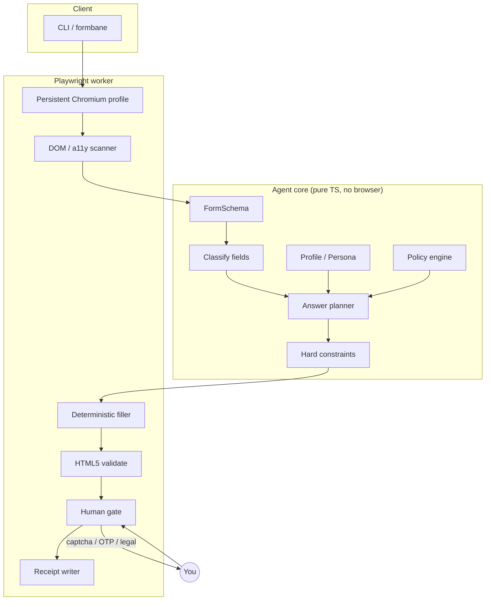
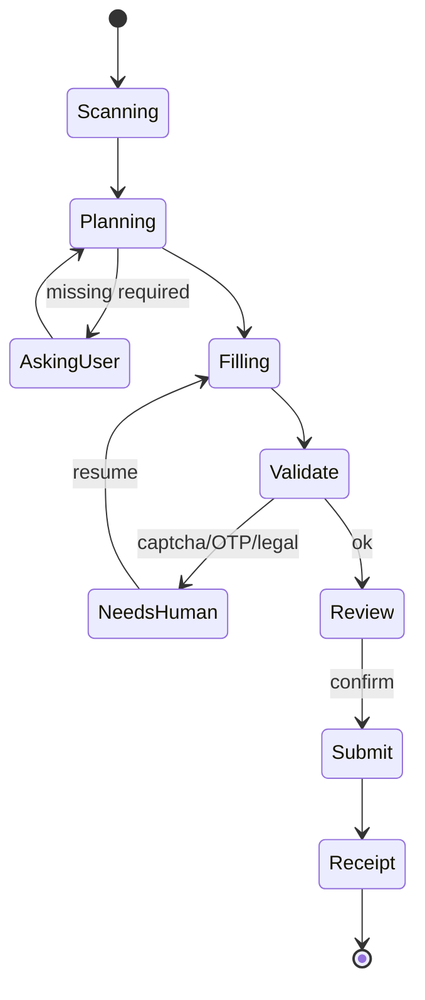

<p align="center">
  
</p>

<h1 align="center">Formbane</h1>

<p align="center">
  <strong>Local form &amp; survey agent.</strong> Scan → plan → fill → you handle captcha → review → receipt.<br/>
  Bureaucracy’s worst nightmare. Your patience’s best friend.
</p>

<p align="center">
  <a href="https://github.com/SeraKah-1/formbane/actions"></a>
  <a href="https://github.com/SeraKah-1/formbane/blob/main/LICENSE"></a>
  <a href="https://nodejs.org/"></a>
  <a href="https://playwright.dev/"></a>
  <a href="https://github.com/SeraKah-1/formbane"></a>
  
</p>

<p align="center">
  <a href="#quickstart">Quickstart</a> ·
  <a href="#how-it-works">How it works</a> ·
  <a href="#policies">Policies</a> ·
  <a href="#llm-custom-endpoint">LLM</a> ·
  <a href="#cli">CLI</a> ·
  <a href="#safety">Safety</a> ·
  <a href="#development">Development</a>
</p>

---

## Why Formbane?

Long surveys. Campus portals. “Please rate our service.” Forms you **must** finish and **don’t** want to think about.

Formbane is **not** a screenshot YOLO-click demon. It is a boring, constrained agent:

1. Controls a **real browser** (Playwright + dedicated profile)
2. Extracts a **structured form schema**
3. Maps fields to your **local profile / persona / policy**
4. Asks **only** what it truly doesn’t know
5. Fills **deterministically**
6. **Pauses** for captcha / OTP / login / payment / legal consent
7. **Reviews** before submit and saves a **receipt**

> Offline-first. LLM is optional assist — never required for planning or clicking.

---

## Quickstart

```bash
git clone https://github.com/SeraKah-1/formbane.git
cd formbane
npm install
npx playwright install chromium
npm test
npm run cli -- init
npm run cli -- fixture simple.html --policy i-dont-care
# CI-safe (no browser deps):
npm run cli -- fixture simple.html --offline --policy i-dont-care
```

Point at a live URL (headed recommended for captcha):

```bash
npm run cli -- run "https://example.com/form" --policy i-dont-care --headed
```

Data lives in `~/.formbane/` (profile, config, browser profile, receipts).

---

## How it works



### Agent loop

```text
scan form
  → normalize fields
  → match profile / persona / policy
  → generate answer plan
  → ask user only for missing / high-risk fields
  → fill deterministically
  → validate
  → pause for captcha / OTP / payment / legal
  → show review
  → submit only after confirmation
  → save receipt
```



---

## Policies

| Preset | Mode | Use when |
|--------|------|----------|
| `i-dont-care` | neutral | Kill the survey. Prefer not / middle / bland text |
| `happy-customer` | best | High scores, short positive comments |
| `angry-but-valid` | worst | Low scores, coherent negative feedback |
| `official-truth` | ask | Bureaucracy — profile facts only, ask missing |
| `survey-persona` | random | Coherent seeded persona (not garbage IID random) |

```bash
npm run cli -- policies
npm run cli -- fixture simple.html --policy happy-customer
```

**Facts** (name, email, DOB…) come from your local profile — never hallucinated legal identity.  
**Opinions** (satisfaction, NPS, fluff) follow the policy mode.

---

## LLM (custom endpoint)

Formbane’s planner works **with LLM disabled**. When enabled, it talks to any **OpenAI-compatible** API:

| Setting | Env | Config key |
|---------|-----|------------|
| Base URL | `FORMBANE_LLM_BASE_URL` or `OPENAI_BASE_URL` | `llm.baseUrl` |
| API key | `FORMBANE_LLM_API_KEY` or `OPENAI_API_KEY` | `llm.apiKey` |
| Model | `FORMBANE_LLM_MODEL` or `OPENAI_MODEL` | `llm.model` |
| Enable | `FORMBANE_LLM_ENABLED=true` | `llm.enabled` |

List models via **`GET {base}/v1/models`**:

```bash
# OpenAI
npm run cli -- llm --base-url https://api.openai.com --api-key "$OPENAI_API_KEY" --enable --list-models

# Local / gateway (Ollama, vLLM, LiteLLM, OpenRouter, …)
npm run cli -- llm \
  --base-url http://127.0.0.1:11434 \
  --api-key ollama \
  --model llama3.2 \
  --enable \
  --list-models
```

Base URL may be `https://host` or `https://host/v1` — Formbane normalizes to `{base}/v1/models` and `{base}/v1/chat/completions`.

**LLM is used for:** ambiguous field mapping, option valence hints, short open text.  
**LLM is never used for:** inventing legal/medical identity, raw clicking, captcha, payment, silent legal consent.

PII is redacted before assist calls. Profile secrets stay local.

---

## CLI

| Command | Description |
|---------|-------------|
| `formbane init` | Create `~/.formbane` + default profile |
| `formbane profile` | Print profile JSON |
| `formbane config` | Show config (API key masked) |
| `formbane llm` | Set endpoint / key / model; `--list-models` |
| `formbane policies` | List presets |
| `formbane fixture [file]` | Scan/plan/fill local HTML fixtures |
| `formbane run <url>` | Live page flow + receipt |
| `formbane plan --schema file.json` | Pure planner (no browser) |

```bash
npm run cli -- fixture multi-page.html --policy survey-persona
npm run cli -- run https://example.com --policy official-truth --headed --no-fill
```

---

## Safety

Formbane **hard-stops** on:

| Block | Behavior |
|-------|----------|
| Password / OTP | Never auto-fill |
| Payment fields | Human only |
| Legal attestation (“under penalty of perjury…”) | Explicit user confirm |
| Medical guessing | Ask or skip — never invent |
| Official form class | Facts from profile only |

- Dedicated browser profile — **not** your daily Chrome by default  
- Bind local tools to your machine; don’t commit API keys  
- Receipts under `~/.formbane/submissions/` for audit trails  
- You remain responsible for anything submitted

See [`.env.example`](./.env.example) and [issues](https://github.com/SeraKah-1/formbane/issues) for discussion.

---

## Project layout

```text
formbane/
├── src/
│   ├── cli/           # formbane binary
│   ├── core/          # types, policy, persona, planner, valence
│   ├── browser/       # Playwright scan / fill / receipt
│   ├── llm/           # OpenAI-compatible client + assist
│   └── storage/       # ~/.formbane paths & config
├── fixtures/forms/    # simple, multi-page, react-controlled, matrix
├── tests/             # planner + LLM mock server + fixture flow
└── docs/              # mark / assets
```

---

## Development

```bash
npm install
npx playwright install chromium
npm test                 # node:test + tsx
npm run build            # tsc → dist/
FORMBANE_HEADLESS=1 npm run cli -- fixture simple.html
```

### Architecture notes

- **Core is pure** — unit-tested without a browser  
- **Browser worker** owns Playwright only  
- **Site adapters** can plug in later; generic scanner covers native controls + React value setters  

Design background: local personal tool first (not multi-tenant bot farm).

---

## Roadmap (honest)

- [x] Offline planner + policy presets  
- [x] Playwright scan / fill / multi-page fixtures  
- [x] Custom LLM endpoint + `/v1/models`  
- [x] Receipts + hard human gates  
- [ ] MCP server surface  
- [ ] Browser extension “fill this tab”  
- [ ] Richer site adapters (Google Forms, Typeform)

---

## Contributing

PRs welcome. Keep the loop constrained: **no unrestricted `browser_do_whatever(prompt)` as the main API.**

1. Fork → branch → `npm test`  
2. Open a [pull request](https://github.com/SeraKah-1/formbane/pulls)  
3. File bugs via [issues](https://github.com/SeraKah-1/formbane/issues)

---

## License

[MIT](./LICENSE) © SeraKah-1

---

<p align="center">
  <sub>Named <b>Formbane</b> — short for “form + bane.” Forms fear it. You finish faster.</sub>
</p>
